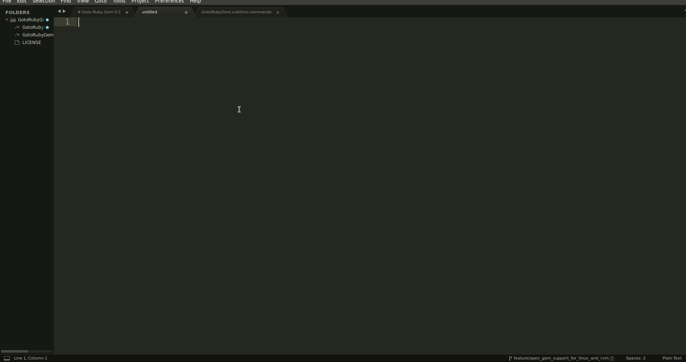

# Goto Ruby Gem 0.3.0

This plugin is designed for Ruby projects and allows you to quickly access the code of any installed gem. It opens the gem's source code in a new Sublime Text window for easy inspection.



## Installation

1. Open Sublime Text.
2. Press Ctrl + Shift + P (Linux) or Cmd + Shift + P (Mac) to open the Command Palette.
3. Type Install Package and press Enter.
4. Type "GotoRubyGem" and press Enter to install.

## How to Use

1. Press `Ctrl + Shift + P` (Linux) or `Cmd + Shift + P` (Mac) in Sublime Text.
2. Type "Goto Ruby Gem" and press enter.
3. It will display a list of all installed gems.
4. Select a gem from the list, and the plugin will open its source code in a new window.

## Specifying Custom Directories (optional)

For specifying custom directories from which gems should be searched:

Store configurations directly in Sublime Text's settings:
Open Preferences > Package Settings > GotoRubyGem and refer to Settings - Default for an example.
You can customize GotoRubyGem using the following configurations:

- **use_custom_gems_directories**:
  - Controls whether to use custom directories for gem searching.
  - *Default*: `false`
  - *Options*:
    - `true`: Enables searching in custom gem directories specified in `custom_gems_directories`.
    - `false`: Uses the default gem directory for searching.
- **custom_gems_directories**:
  - A list of absolute paths where gems should be searched.
  - *Usage*:
    - Specify paths only if `use_custom_gems_directories` is set to `true`.
    - If empty and `use_custom_gems_directories` is `true`, no gems will be searched.

**Example Configuration**:

Now Gems will only be searched inside `/home/vals/.rvm/rubies/ruby-3.1.4/lib/ruby/gems/3.1.0/gems`

```json
  {
    "use_custom_gems_directories": true,
    "custom_gems_directories": [
        "/home/vals/.rvm/rubies/ruby-3.1.4/lib/ruby/gems/3.1.0/gems"
    ]
  }
```

## limitations
* Experimental support for Sublime Text for Linux/Mac with RVM/rbenv.

Enjoy exploring gem code easily with Goto Ruby Gem!

## Feedback
Your feedback and suggestions are valuable! Feel free to open issues or contribute to the project.
